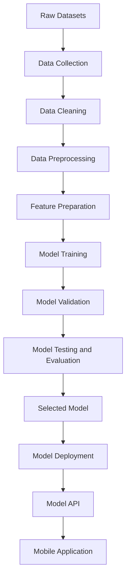
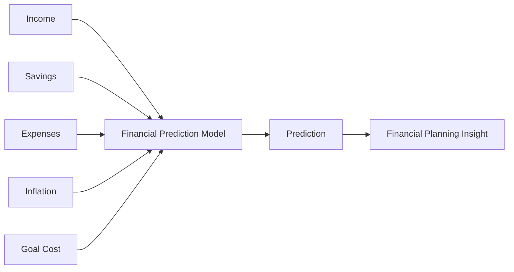
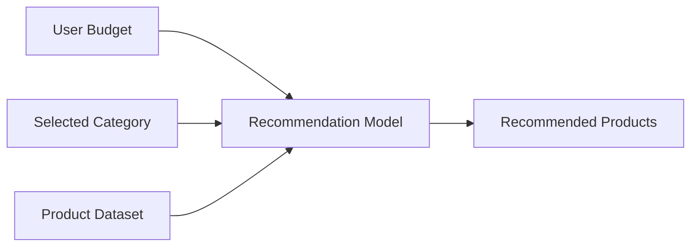
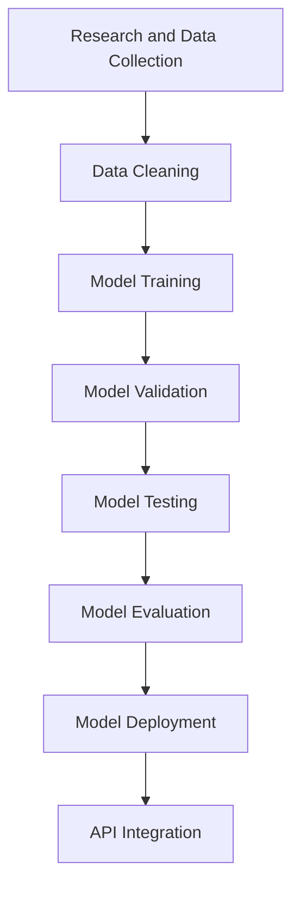
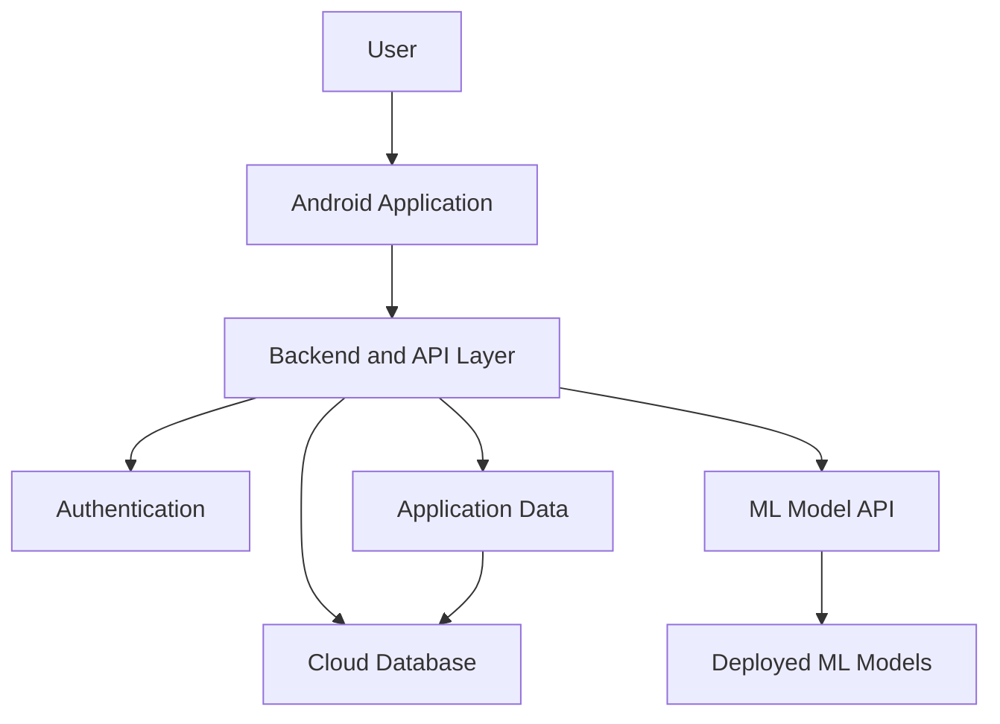
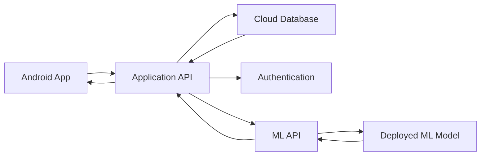
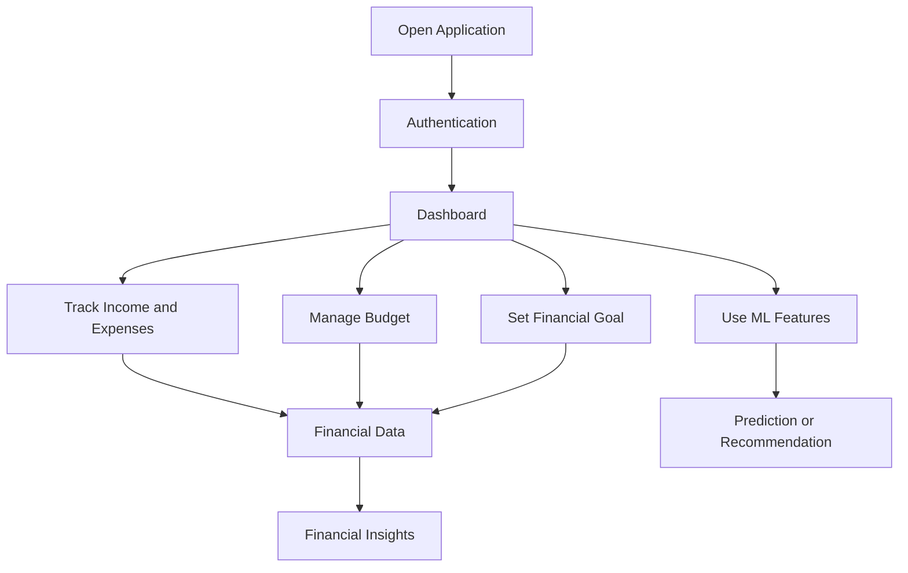
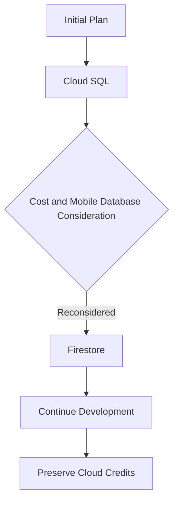
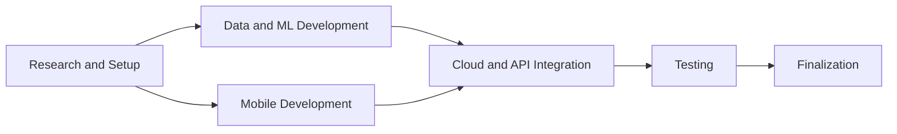

# BROFIN — Brother Financial

> **AI-powered personal finance and financial goal planning application**

Brofin (Brother Financial) is a product-based capstone project designed to help Gen Z, young professionals, and users with long-term financial goals manage their finances more effectively through budgeting, financial goal planning, and machine-learning-powered features.

---

## Project Highlights

| Category         | Details                                                         |
| ---------------- | --------------------------------------------------------------- |
| **Project**      | Brofin (Brother Financial)                                      |
| **Project Type** | Product-based Capstone Project                                  |
| **Theme**        | Economics Empowerment: Navigating Sustainable Economies for All |
| **Role**         | Machine Learning Engineer                                       |
| **Team Size**    | 7 members                                                       |
| **Duration**     | 6 months                                                        |
| **Platform**     | Android                                                         |
| **Core Areas**   | Machine Learning, Mobile Development, Cloud Computing           |
| **Status**       | Completed                                                       |

The project documentation states that the project was completed at 100%.

---

## Table of Contents

- [Project Overview](#project-overview)
- [The Problem](#the-problem)
- [The Solution](#the-solution)
- [Target Users](#target-users)
- [Key Features](#key-features)
- [My Contribution](#my-contribution)
- [Machine Learning Architecture](#machine-learning-architecture)
- [Machine Learning Models](#machine-learning-models)
- [Machine Learning Workflow](#machine-learning-workflow)
- [System Architecture](#system-architecture)
- [Application Workflow](#application-workflow)
- [Technology Stack](#technology-stack)
- [Architecture Decision](#architecture-decision)
- [Challenges & Solutions](#challenges--solutions)
- [Project Outcome](#project-outcome)
- [What I Learned](#what-i-learned)
- [Timeline](#timeline)
- [Team](#team)
- [Project Resources](#project-resources)
- [Documentation Notes](#documentation-notes)

---

# Project Overview

Brofin was developed to address financial-management challenges faced by young users, particularly Gen Z and people with long-term financial responsibilities.

The project focuses on making financial planning easier to understand and more actionable by combining:

- Daily income and expense management
- Budget allocation
- Financial goal planning
- Machine-learning-based prediction
- Machine-learning-based recommendation

The core idea is to help users move from simply tracking their money to planning how their current financial condition can support future goals.

---

# The Problem

Young users may understand the importance of financial planning but still struggle to apply it consistently in daily life.

The project documentation identifies several challenges:

- Difficulty tracking spending
- Difficulty controlling expenses
- Difficulty achieving long-term financial goals
- Irregular income patterns among some young professionals and freelancers
- Increasing prices of necessities and property
- Difficulty planning for major financial goals such as buying a home

These problems motivated the development of Brofin as a financial-management companion.

### Problem Statement

> **How might we help young users manage their current finances while making long-term financial goals more realistic and measurable?**

---

# The Solution

Brofin combines conventional financial-management functionality with machine-learning-powered features.

The solution consists of several connected capabilities:

### 1. Budgeting

Brofin uses the **50-30-20 budgeting principle** to help users allocate their income between needs, wants, and savings.

### 2. Financial Goal Planning

Users can define financial goals and track the amount of money they need to set aside.

### 3. Financial Prediction

Machine learning is used for financial-planning scenarios described in the project documentation, including house-price-related prediction and financial-goal prediction.

### 4. Product Recommendation

The project also describes a recommendation system that matches products with the user's budget and selected category.

---

# Target Users

The primary target market described in the project documentation is:

- Gen Z
- Young professionals
- First-time workers
- Users who are learning to manage personal finances
- Gen Z users in the sandwich generation
- Young couples planning financial goals together

The documentation describes the main target age range as **18–28 years old**.

---

# Key Features

## Financial Dashboard

A central place for users to monitor their financial condition and access the application's core financial-management features.

## Budgeting

The budgeting feature applies the 50-30-20 principle:

```text
Income
  |
  +-- 50% -> Needs
  |
  +-- 30% -> Wants
  |
  +-- 20% -> Savings
```

The goal is to make users more aware of spending priorities and encourage disciplined financial behavior.

## Income & Expense Tracking

Users can track daily income and expenses and use the resulting information to understand their financial condition.

## Financial Goals

Users can define financial goals such as saving for major purchases and monitor the progress toward those goals.

## House / Financial Goal Prediction

The project documentation describes machine-learning-based prediction for financial planning, including house-price-related prediction and estimating when a user may reach a financial goal.

## Product Recommendation

The recommendation feature is designed to suggest products according to the user's budget and selected category.

The project documentation identifies five product categories used in the recommendation work:

- Cars
- Gadgets
- Motorcycles
- Games
- Luxury goods

---

# My Contribution

## Role: Machine Learning Engineer

My contribution focused on the Machine Learning component of Brofin.

### Data Preparation

The ML work included:

- Data collection
- Data cleansing
- Data preprocessing
- Dataset preparation for model development

### Model Development

The ML work included:

- Model development
- Model training
- Model validation
- Model testing
- Model evaluation

### Model Integration

The project plan also assigned the ML team responsibility for preparing the model so it could be deployed and integrated with the rest of the application through cloud/API services.

### Cross-Functional Collaboration

Because Brofin was developed by Machine Learning, Cloud Computing, and Mobile Development teams, the ML component had to work together with:

- Mobile application functionality
- Backend/API services
- Cloud infrastructure
- Database and application data flow

---

# Machine Learning Architecture

The following diagram represents the ML workflow at a portfolio level based on the project's documented ML responsibilities.



---

# Machine Learning Models

## Model 1 — Financial Goal / House Planning

The project documentation describes an ML approach for financial planning using user and economic variables.

Potential inputs documented in the project plan include:

- Income
- Savings
- Expenses
- Inflation
- Goal cost

The documented objective includes predicting financial outcomes such as:

- House-price-related estimates
- Expected timing for achieving a financial goal

The project plan mentions neural networks or linear regression as possible approaches for the financial-goal prediction component.

### Conceptual Flow



> **Portfolio note:** Add the actual model type, dataset size, evaluation metrics, and final experiment results here once those values are available from the ML notebooks or final model documentation.

---

## Model 2 — Product Recommendation

The project documentation describes a machine-learning-based product recommendation system.

The recommendation process is based on:

- User budget
- User-selected category
- Product-related datasets

The documented categories are:

- Cars
- Gadgets
- Motorcycles
- Games
- Luxury goods

### Conceptual Flow



The project brief describes five separate recommendation models corresponding to the five product categories.

---

# Machine Learning Workflow

The project plan identifies the following ML workflow:



---

# System Architecture

Brofin combines a mobile application, cloud services, APIs, databases, and machine learning models.

The architecture below is a simplified portfolio representation based on the project documentation.



## Cloud and ML Deployment

The project brief documents the use of Google Cloud services for application deployment and ML model serving. It specifically describes application APIs and cloud database functionality, with ML model features deployed through cloud services.

A more detailed conceptual representation is:



---

# Application Workflow

A simplified user workflow can be represented as:



---

# Technology Stack

## Machine Learning

Based on the project documentation:

- TensorFlow
- Pandas
- NumPy
- Scikit-learn
- Google Colab
- Jupyter Notebook
- Matplotlib
- Seaborn

## Mobile Development

The project plan documents:

- Android Studio
- Kotlin
- Jetpack Compose
- Room
- DataStore
- Retrofit
- OkHttp
- Hilt
- Lottie
- Coil

## Cloud / Backend

The project documentation references Google Cloud services and technologies including:

- Firestore
- Cloud Run
- App Engine
- Cloud Storage
- API services
- Authentication services

> The exact service usage should be aligned with the final deployed architecture when the repository/deployment configuration is documented in more detail.

---

# Architecture Decision

## Cloud SQL to Firestore

One documented architecture decision was changing the planned database approach.

The team initially considered using **Cloud SQL**, but later switched to **Firestore**.

The reason documented by the team was:

- Cloud SQL cost considerations
- The mobile application was already using a NoSQL database approach
- The change helped preserve cloud credits for other resources

The documented outcome was that the application continued to run smoothly after the change.

This is an important example of a real engineering trade-off:



---

# Challenges & Solutions

## 1. Dataset Quality

### Challenge

Machine-learning performance can be affected by the quality and relevance of training data.

### Approach

The ML project plan explicitly included:

- Data collection
- Data cleansing
- Model validation
- Model testing
- Model evaluation

---

## 2. Model Reliability

### Challenge

The project documentation identified model reliability and accuracy as an important concern.

### Approach

The ML workflow included validation, testing, and evaluation before model deployment.

---

## 3. Limited Cloud Resources

### Challenge

The team had to manage Google Cloud resource consumption and available credits.

### Approach

The project considered cost during architecture decisions and changed the database approach from Cloud SQL to Firestore.

---

## 4. Cross-Team Integration

### Challenge

Brofin required the ML, mobile, and cloud components to work together.

### Approach

The project plan explicitly identified the need to connect backend services with the mobile application and ML models.

---

## 5. Limited Development Time

### Challenge

The project documentation identified the available project time and feature completeness as project risks.

### Approach

The team prioritized the MVP and focused development on the core financial-management and ML functionality.

---

# Project Outcome

The project documentation reports:

**Project Status: 100% Completed**

The final product combines financial-management functionality with machine-learning-powered prediction and recommendation features.

The documented result includes:

- Budgeting functionality
- Income and expense tracking
- Financial goal planning
- Financial prediction capabilities
- Product recommendation capabilities
- Android mobile application
- Cloud/API integration
- ML deployment workflow

---

# What I Learned

## Machine Learning in a Product Context

Building an ML model is only one part of an ML product. The model also needs to be connected to application requirements, APIs, deployment infrastructure, and user-facing functionality.

## Data Preparation Matters

Model development depends heavily on the quality and preparation of data. Data collection, cleaning, preprocessing, validation, and evaluation are essential parts of the workflow.

## Deployment Is Part of ML Engineering

An ML solution becomes more useful when it can be integrated into a real application. This project provided experience with the transition from model development to deployment and API integration.

## Cross-Functional Collaboration

Brofin required close coordination between ML, Mobile Development, and Cloud Computing teams. This highlighted the importance of clearly defining interfaces and data flow between components.

## Engineering Trade-offs

The Cloud SQL to Firestore change demonstrated that technical decisions are not based only on theoretical architecture. Cost, existing implementation, available resources, and project constraints also matter.

---

# Timeline

The project was developed over approximately six months.

A portfolio-level representation of the development process is:



---

# Team

Brofin was developed by a seven-member multidisciplinary team.

### Machine Learning Team

- Ahmad Alfin Nur Hakim
- Muhammad Azis Saputra
- Silvi Kusuma Wardhani Gunawan

### Cloud Computing Team

- Muhamad Prianda
- Mukhlis Gia Tegar

### Mobile Development Team

- Muhammad Sammy Yudistira
- Muhamad Muslih

### My Role

> **Machine Learning Engineer — Muhammad Azis Saputra**

My work was focused on the Machine Learning component, including the documented data preparation, model training, validation, testing, evaluation, and model integration workflow.

---

# Project Resources

| Resource                         | Link / Status                                           |
| -------------------------------- | ------------------------------------------------------- |
| GitHub Organization / Repository | [CP-Finance-Goals](https://github.com/CP-Finance-Goals) |
| Demo Video                       | Available in project documentation                      |
| APK                              | Available in project documentation                      |
| Dataset                          | Available in project documentation                      |
| Model Notebook                   | Available in project documentation                      |
| Presentation Video               | Available in project documentation                      |
| Slide Presentation               | Available in project documentation                      |

---

# Documentation Notes

This portfolio documentation is intentionally focused on the project story and the Machine Learning contribution rather than reproducing the complete capstone report.

## Important source consistency note

The supplied project documents contain some differences in how features are described.

For example:

- The project brief describes budgeting, ML-powered prediction, and financial guidance/chatbot functionality.
- Elsewhere in the same documentation, the chatbot is described as a feature that was planned for a later stage because of cost and time constraints.
- The project plan describes two main ML directions: financial/house planning and financial-goal prediction, while the project brief additionally describes a product recommendation system with five category-specific models.

Because of these differences, this portfolio emphasizes the features and responsibilities that are consistently supported across the supplied project materials and avoids claiming undocumented implementation details as final facts.

## Recommended additions before publishing

To make this case study stronger, add concrete technical results wherever available:

- Final model names
- Dataset size
- Number of features
- Train/validation/test split
- Evaluation metrics
- Best model result
- Training time
- Inference time
- Number of API endpoints
- Number of application screens
- Final cloud architecture
- Screenshots of the final application
- ML experiment visualizations
- Final demo video

These details should come from the final source code, notebooks, deployment configuration, or experiment results rather than being estimated.

---

# Credits

Brofin was developed as a product-based capstone project by a multidisciplinary team across Machine Learning, Cloud Computing, and Mobile Development.

**Team ID:** C242-PS338  
**Project:** Brofin — Brother Financial
