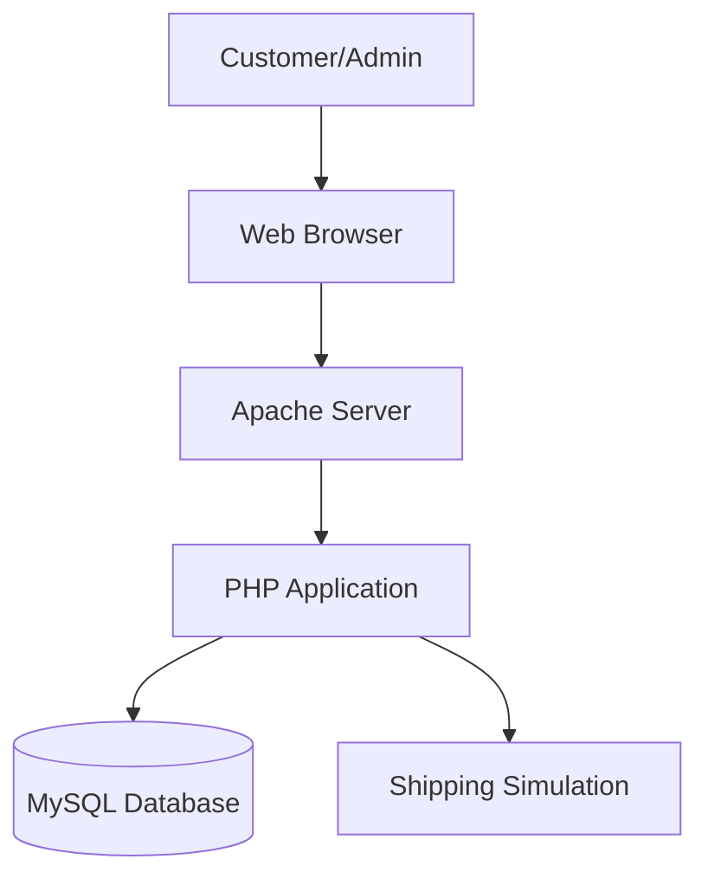
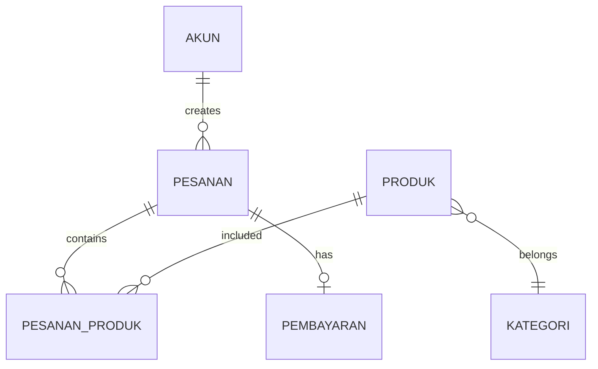
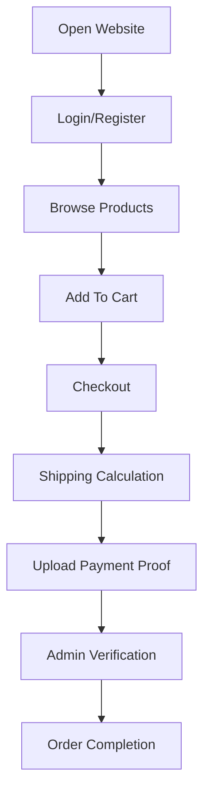

# ETOMAC --- Heavy Equipment E-Commerce Platform

> Specialized e-commerce platform for agricultural and industrial heavy
> equipment.

---

## Project Highlights

| Category         | Details                                             |
| ---------------- | --------------------------------------------------- |
| **Project**      | Etomac                                              |
| **Project Type** | Freelance Project                                   |
| **Role**         | Full Stack Web Developer                            |
| **Team Size**    | Independent                                         |
| **Duration**     | 1 Week                                              |
| **Technology**   | HTML, CSS, JavaScript, Bootstrap, PHP Native, MySQL |
| **Server**       | Apache / XAMPP                                      |
| **Platform**     | Web Application                                     |
| **Status**       | Completed                                           |

---

## Table of Contents

- [Project Overview](#project-overview)
- [Problem Statement](#problem-statement)
- [Solution](#the-solution)
- [My Contribution](#my-contribution)
- [System Architecture](#system-architecture)
- [Database Relationship](#database-relationship)
- [Application Workflow](#application-workflow)
- [Technology Stack](#technology-stack)
- [Challenges & Solutions](#challenges--solutions)
- [Project Outcome](#project-outcome)
- [What I Learned](#what-i-learned)
- [Project Information](#project-information)

---

# Project Overview

Etomac is a web-based e-commerce application designed specifically for
selling heavy equipment, especially tractors for agricultural and
industrial needs.

The application provides a complete digital transaction workflow
including product browsing, category filtering, shopping cart
management, checkout, shipping simulation, payment proof upload, and
order management.

---

# Problem Statement

Traditional heavy equipment purchasing processes often require direct
communication with sellers and manual transactions. Users may face
difficulties finding specialized platforms, comparing specifications,
understanding prices, and estimating logistics costs.

Etomac was developed to provide a centralized marketplace for heavy
equipment transactions.

---

# Solution

The system provides:

- Digital heavy equipment catalog
- Product detail pages
- Search and category filtering
- Shopping cart
- Checkout workflow
- Shipping cost simulation
- Payment proof submission
- Customer order history
- Admin management dashboard

---

# My Contribution

## Full Stack Web Developer

My responsibilities covered frontend development, backend logic, and
database implementation.

### Frontend Development

Implemented:

- Product catalog interface
- Product detail display
- Shopping cart interface
- Checkout pages
- Responsive layout

Technology:

- HTML5
- CSS3
- JavaScript
- Bootstrap

### Backend Development

Developed PHP-based application logic:

- Authentication system
- Session management
- Product processing
- Cart handling
- Checkout processing
- Payment upload handling
- Order management

### Database Design

Designed relational structures for:

- User accounts
- Product categories
- Products
- Orders
- Payments
- Product variations

---

# System Architecture

---

# Database Relationship

---

# Application Workflow

---

# Technology Stack

## Frontend

- HTML5
- CSS3
- JavaScript
- Bootstrap

## Backend

- PHP Native
- Session Management

## Database

- MySQL / MariaDB

## Server

- Apache
- XAMPP

---

# Challenges & Solutions

## Heavy Equipment Shipping Logic

Challenge: Calculating shipping costs for heavy equipment is complex due
to weight and transportation requirements.

Solution: Implemented shipping simulation logic to maintain complete
checkout functionality.

## Complex Product Structure

Challenge: Products require multiple classifications such as type,
edition, and color.

Solution: Implemented normalized database tables with relational
connections.

## Stock Validation

Challenge: Maintaining accurate inventory during transactions.

Solution: Added stock validation during checkout before order
confirmation.

---

# Project Outcome

Etomac successfully implemented a complete heavy equipment e-commerce
workflow:

- Product management
- Customer authentication
- Shopping cart
- Checkout system
- Payment handling
- Admin order validation

---

# What I Learned

- Designing full-stack web applications
- Building relational database structures
- Implementing authentication and sessions
- Developing transaction workflows
- Managing backend business logic

---

# Project Information

Item Details

---

Repository Not Available
Live Demo Not Available
Timeline January 2025
Duration 1 Week
Team Size Independent
Status Completed
