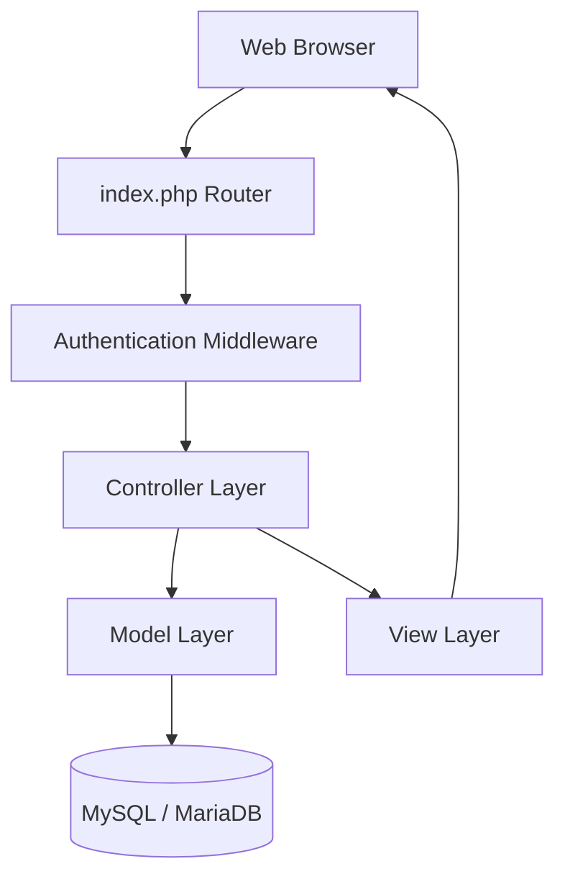
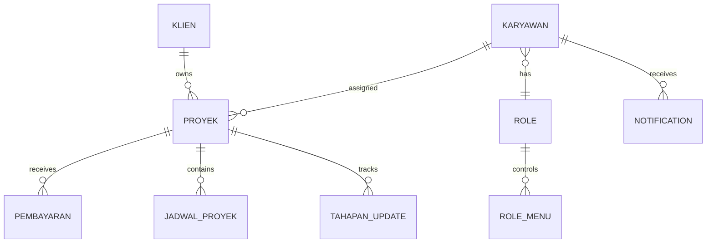
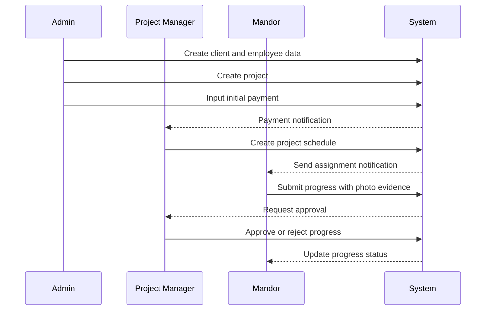

# Manajemen Proyek CV Graha Raya Consultant

> **Web-based project management information system with role-based
> workflow and progress approval**

---

## Project Highlights

| Category         | Details                                   |
| ---------------- | ----------------------------------------- |
| **Project**      | Manajemen Proyek CV Graha Raya Consultant |
| **Project Type** | Freelance Project                         |
| **Role**         | Full Stack Web Developer                  |
| **Team Size**    | Independent                               |
| **Duration**     | 1 month                                   |
| **Platform**     | Web Application                           |
| **Architecture** | Custom MVC PHP Native                     |
| **Status**       | Completed on Local                        |

---

## Table of Contents

- [Project Overview](#project-overview)
- [Problem Statement](#problem-statement)
- [Solution](#solution)
- [Key Features](#key-features)
- [My Contribution](#my-contribution)
- [System Architecture](#system-architecture)
- [Database Design](#database-design)
- [Application Workflow](#application-workflow)
- [Technology Stack](#technology-stack)
- [Challenges & Solutions](#challenges--solutions)
- [Project Outcome](#project-outcome)
- [What I Learned](#what-i-learned)
- [Project Information](#project-information)
- [Credit](#credit)
- [Target Users](#target-users)
- [Machine Learning Architecture](#machine-learning-architecture)
- [Machine Learning Models](#machine-learning-models)
- [Machine Learning Workflow](#machine-learning-workflow)
- [Architecture Decision](#architecture-decision)
- [Timeline](#timeline)
- [Team](#team)
- [Project Resources](#project-resources)
- [Documentation Notes](#documentation-notes)

---

# Project Overview

Aplikasi Manajemen Proyek CV Graha Raya Consultant is a web-based
information system developed to digitalize the complete project
management workflow, from client management, project creation, payment
tracking, scheduling, field progress reporting, until project approval.

The system focuses on improving collaboration between three main
stakeholders:

- Admin
- Project Manager
- Mandor (Field Supervisor)

through a centralized platform with Role-Based Access Control (RBAC).

---

# Problem Statement

Before system implementation, project monitoring and operational
management faced several challenges:

- Field progress monitoring was still performed manually.
- Communication between office teams and field workers could cause
  delays.
- Payment records, schedules, and project documentation were not
  centralized.
- Progress updates from field teams lacked a structured approval
  mechanism.

These challenges created difficulties in monitoring project performance,
evaluating progress, and maintaining historical project records.

---

# Solution

A centralized project management information system was developed with
role-based workflows.

The system provides different access levels:

## Admin

Responsible for:

- Managing employee data
- Managing client data
- Creating projects
- Recording client payments
- Supervising overall project information

## Project Manager

Responsible for:

- Creating project schedules
- Managing project stages
- Reviewing field progress
- Approving or rejecting progress submissions

## Mandor

Responsible for:

- Receiving project assignments
- Reporting field progress
- Uploading progress evidence such as photos and documents

---

# Key Features

## 1. Role-Based Access Control (RBAC)

The system implements dynamic access management for:

- Admin
- Project Manager
- Mandor

Each role receives different dashboards and permissions.

---

## 2. Master Data Management

Provides CRUD functionality for:

- Employee data
- Client data
- Role management

---

## 3. Project Management

Features include:

- Project creation
- Project documentation upload
- PIC assignment
- Project status monitoring

Supporting documents include:

- RAB / quotation
- Work drawings

---

## 4. Payment Management

The system manages:

- Down payment
- Project installments
- Final payment

Each payment record can include payment evidence upload.

---

## 5. Project Scheduling

Project managers can define:

- Planned start date
- Planned completion date
- Project stage timeline

---

## 6. Progress Approval System

Field workers can submit:

- Progress updates
- Work notes
- Photo evidence

Project managers can:

- Review submissions
- Approve progress
- Reject progress

---

## 7. Internal Notification System

The system provides notifications for:

- Payment updates
- Progress submissions
- Approval status changes

---

# My Contribution

## Role: Full Stack Web Developer

I was responsible for designing and implementing the complete
application workflow.

## Backend Development

Developed application logic using:

- PHP 8
- Custom MVC Architecture

Responsibilities:

- Routing system
- Authentication flow
- Role authorization
- Business logic implementation
- Database interaction
- Notification handling

---

## Frontend Development

Implemented user interfaces using:

- HTML5
- CSS3
- JavaScript ES6+
- Bootstrap 5

Responsibilities:

- Dashboard interface
- Role-based pages
- Form handling
- Data visualization components
- Responsive layout

---

## Database Development

Designed database structures for:

- User management
- Client management
- Project management
- Payment tracking
- Scheduling
- Progress history

---

# System Architecture

---

# Database Design

---

# Application Workflow

---

# Technology Stack

## Backend

- PHP 8
- Custom MVC Architecture

## Frontend

- HTML5
- CSS3
- JavaScript ES6+
- Bootstrap 5

## Database

- MySQL
- MariaDB

## Libraries

- PACE Loading Indicator
- Perfect Scrollbar
- MetisMenu
- Bootstrap Icons
- Ionicons

---

# Challenges & Solutions

## 1. Multi-condition Project Workflow

### Challenge

Project status depends on multiple conditions, such as payment approval
before scheduling.

### Solution

Implemented controlled state flow logic inside controllers to validate
project conditions before allowing actions.

---

## 2. Dynamic Role Permission

### Challenge

Three different user roles require different permissions in one
application.

### Solution

Implemented RBAC middleware integrated with routing and separated views
based on user roles.

---

## 3. Notification Management

### Challenge

Different stakeholders need different notifications depending on project
activities.

### Solution

Created centralized notification handling triggered after important
database events.

---

# Project Outcome

The application successfully provides a structured workflow for CV Graha
Raya Consultant project management.

The system improves:

- Project monitoring
- Communication between office and field teams
- Payment tracking
- Progress validation
- Historical documentation

The application demonstrates implementation of a complete business
information system with role-based workflow.

---

# What I Learned

## MVC Architecture

Learned how to structure PHP applications into:

- Router
- Controller
- Model
- View

to improve maintainability.

## Database Modeling

Improved experience designing relational database structures for complex
business processes.

## Business Workflow Development

Learned that software systems must represent real operational processes,
not only CRUD functionality.

## Access Control

Gained experience implementing secure role-based access management.

---

# Project Information

Item Details

---

Repository Not Available
Live Demo Not Available
API Documentation Not Available
Timeline March 2025 - April 2025
Team Size Independent
Status Completed on Local

---

# Credits

This project was developed as a full-stack web information system for
managing construction project operations at CV Graha Raya Consultant.
