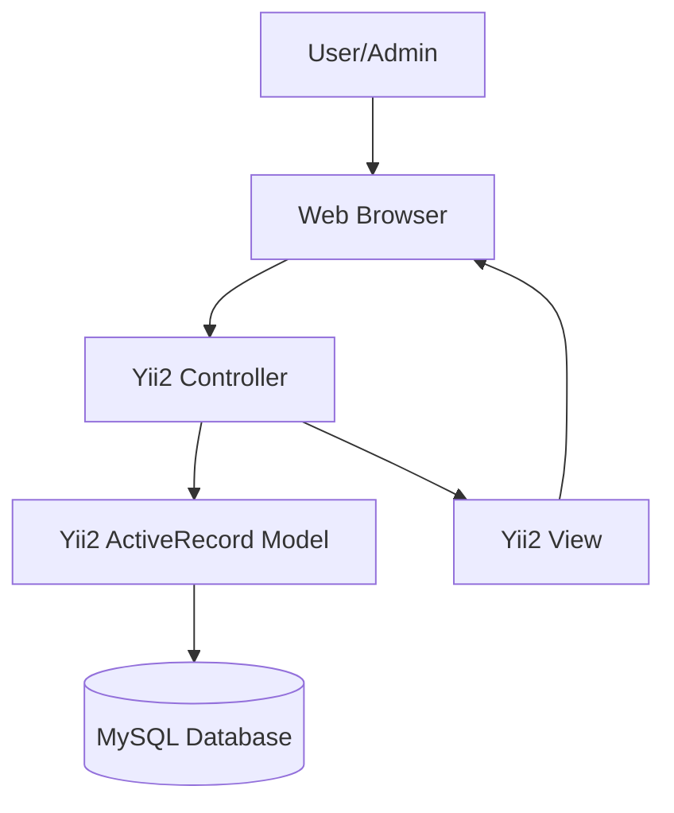
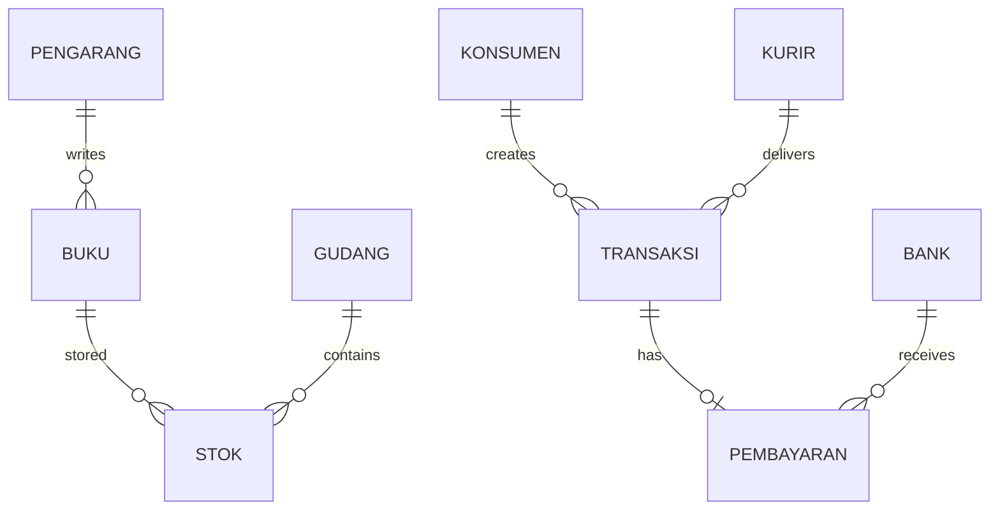
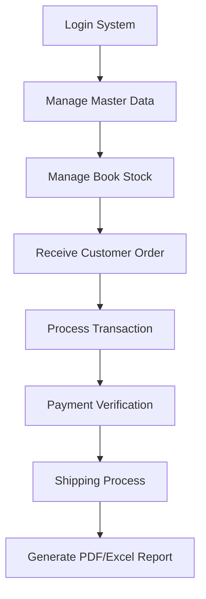

# SIBUKU --- Book Store Management Information System

> **Web-based bookstore operational management system with inventory,
> transaction, and reporting automation**

---

## Project Highlights

| Category         | Details                         |
| ---------------- | ------------------------------- |
| **Project**      | Sibuku                          |
| **Project Type** | Intern Project                  |
| **Role**         | Full Stack Web Developer        |
| **Team Size**    | Independent                     |
| **Timeline**     | 1 month (April 2024 - May 2024) |
| **Architecture** | Yii2 MVC Framework              |
| **Platform**     | Web Application                 |
| **Status**       | Completed on Local              |

---

## Table of Contents

- [Project Overview](#project-overview)
- [Problem Statement](#problem-statement)
- [Solution](#solution)
- [Key Features](#key-features)
- [My Contribution](#my-contribution)
- [System Architecture](#system-architecture)
- [Database Design](#database-design)
- [Application Workflow](#application-workflow)
- [Technology Stack](#technology-stack)
- [Challenges & Solutions](#challenges--solutions)
- [Project Outcome](#project-outcome)
- [What I Learned](#what-i-learned)
- [Project Information](#project-information)
- [Credits](#credits)

---

# Project Overview

Sibuku is a web-based information system developed to digitalize
bookstore operational activities. The application integrates master data
management, inventory management, sales transactions, payment
processing, and automated reporting.

The system helps bookstore administrators and employees manage the
complete business workflow from book data management until sales
reporting.

---

# Problem Statement

Traditional bookstore management processes often face several
challenges:

- Difficulty monitoring book stock availability in real-time.
- Sales transactions and payment records are not centralized.
- Report generation requires manual data recap.
- Supporting data such as customers, authors, couriers, and employees
  are separated.

These problems reduce operational efficiency and increase the
possibility of inconsistent data.

---

# Solution

Sibuku was developed as an integrated bookstore management platform
with:

- Centralized master data management
- Structured warehouse inventory management
- Digital sales transaction processing
- Payment tracking
- Courier management
- Automated PDF and Excel reporting

The system provides a single platform for managing bookstore operations.

---

# Key Features

## 1. User Management

Provides authentication and access management for:

- Administrator
- Employee

The system also includes activity logging for operational history
tracking.

---

## 2. Master Data Management

Manages important business entities:

- Books
- Authors
- Customers
- Banks
- Couriers

---

## 3. Inventory Management

The inventory module manages:

- Warehouse data
- Book stock records
- Stock availability monitoring
- Book movement tracking

---

## 4. Transaction and Payment Management

The transaction system supports:

- Multiple book items in one transaction
- Price calculation
- Weight calculation
- Shipping cost calculation
- Online/offline transaction types
- Payment confirmation
- Courier tracking number management

---

## 5. Reporting System

The application can generate operational reports:

- Sales reports
- Financial reports
- Stock reports

Export formats:

- PDF
- Excel

---

# My Contribution

## Role: Full Stack Web Developer

I developed the application workflow from backend logic, frontend
interface, and database integration.

---

## Backend Development

Technology:

- PHP \>= 7.4
- Yii2 Framework

Responsibilities:

- Controller development
- Business process implementation
- Authentication flow
- Transaction processing
- Report generation logic
- Database interaction using ActiveRecord

---

## Frontend Development

Technology:

- HTML5
- CSS3
- JavaScript
- Bootstrap 5

Implemented:

- Dashboard interface
- Data management pages
- Transaction forms
- Reporting interface

---

## Database Development

Designed relational structures for:

- Books
- Authors
- Warehouse stock
- Customers
- Transactions
- Payments

---

# System Architecture

---

# Database Design

---

# Application Workflow

---

# Technology Stack

## Backend

- PHP
- Yii2 Framework

## Frontend

- HTML5
- CSS3
- JavaScript
- Bootstrap 5

## Database

- MySQL

## Libraries

- mPDF
- PhpSpreadsheet
- Kartik-v Widgets
- CKEditor
- yii2-multiple-input

## Tools

- Composer
- XAMPP

---

# Challenges & Solutions

## 1. Multiple Book Items Transaction

### Challenge

A single transaction may contain multiple books and quantities.

### Solution

Implemented multiple input handling using Yii2 extension and JSON-based
item storage.

---

## 2. Data Consistency

### Challenge

Maintaining consistent data format between interface and database.

### Solution

Used Yii2 ActiveRecord lifecycle methods such as:

- beforeSave()
- afterFind()

for validation and data transformation.

---

## 3. Automated Reporting

### Challenge

Generating professional reports from dynamic database data.

### Solution

Integrated:

- mPDF for PDF generation
- PhpSpreadsheet for Excel export

---

# Project Outcome

Sibuku successfully transformed bookstore operational activities into a
digital workflow.

The system provides:

- Automated inventory management
- Integrated sales transactions
- Payment management
- Courier management
- Report generation

The project demonstrates implementation of a complete business
information system using MVC architecture.

---

# What I Learned

## MVC Framework Development

Improved understanding of Yii2 MVC architecture and application
lifecycle.

## Database Modeling

Experienced designing relational databases for inventory and transaction
systems.

## Third-party Integration

Learned managing external PHP packages using Composer.

## Business System Development

Improved ability to translate real business processes into software
workflows.

---

# Project Information

Item Details

---

Repository Not Available
Live Demo Not Available
API Documentation Not Available
Timeline April 2024 - May 2024
Team Size Independent
Status Completed on Local

---

# Credits

Sibuku was developed as a bookstore management information system
focused on improving inventory, transaction, and reporting efficiency.
