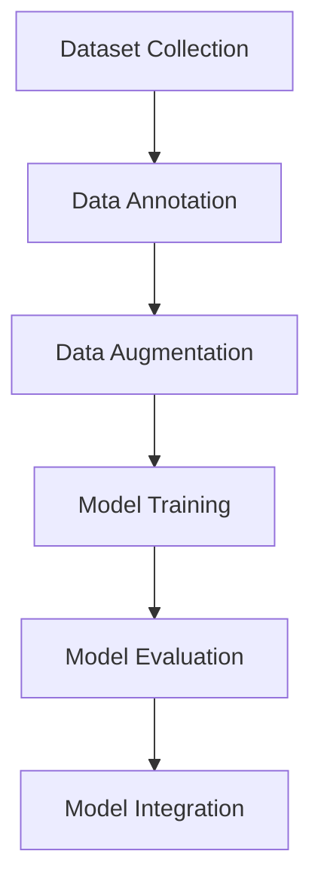
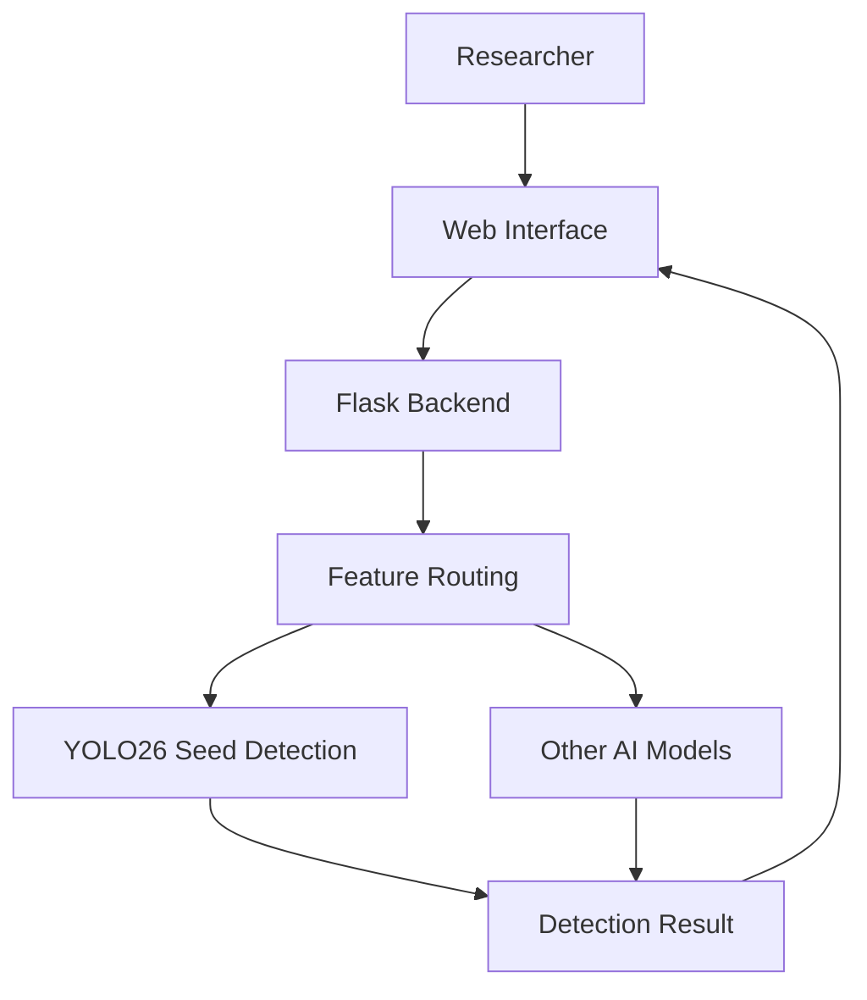
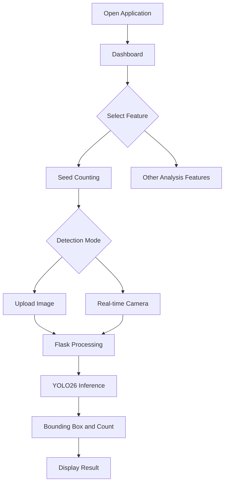

# SUPER SOYBEAN --- Smart Agriculture Web Platform

> **Computer Vision-based web platform for soybean phenotypic analysis**

---

## Project Highlights

| Category            | Details                                        |
| ------------------- | ---------------------------------------------- |
| **Project**         | Super Soybean                                  |
| **Project Type**    | Product-based Research Project                 |
| **Domain**          | Smart Agriculture / Computer Vision            |
| **Role**            | AI Engineer, UI/UX Designer, Backend Developer |
| **Team Size**       | 4 Members                                      |
| **Duration**        | 3 Months (September – December 2025)           |
| **Main Technology** | Flask, Computer Vision, YOLO, PyTorch          |
| **Platform**        | Web Application                                |
| **Status**          | Completed                                      |

---

## Table of Contents

- [Project Overview](#project-overview)
- [Problem Statement](#problem-statement)
- [Solution](#the-solution)
- [My Contribution](#my-contribution)
- [System Architecture](#system-architecture)
- [Backend Development](#backend-development)
- [Frontend & UI/UX Design](#frontend--uiux-design)
- [Application Workflow](#application-workflow)
- [Technology Stack](#technology-stack)
- [Challenges & Solutions](#challenges--solutions)
- [Project Outcome](#project-outcome)
- [Key Learn](#key-learn)
- [Project Information](#project-information)
- [Credits](#credits)

---

# Project Overview

SOYBEAN is an intelligent web platform developed to support soybean
breeding research through Computer Vision technology. The application
provides an integrated environment for analyzing soybean phenotypic
characteristics, reducing manual observation effort and improving
efficiency in agricultural research.

The system combines multiple AI-based features into one responsive web
application, including seed counting, pod analysis, classification,
variety identification, and leaf chlorophyll prediction.

---

# Problem Statement

Phenotypic data collection is an important process in soybean breeding
research. However, traditional observation methods are often:

- Time-consuming
- Repetitive
- Dependent on manual counting
- Vulnerable to human error

Researchers need a digital platform that can automatically analyze plant
characteristics from images and provide faster, more consistent results.

---

# Solution

SOYBEAN provides an AI-powered analysis platform that transforms soybean
images into meaningful research information.

The application consists of several Computer Vision modules:

1.  **Seed Counting**
    - Detects and counts soybean seeds automatically.
    - Supports image upload and real-time detection.
2.  **Pod Counting**
    - Detects soybean pods and estimates seed quantity inside pods.
3.  **Classification**
    - Classifies soybean conditions based on visual characteristics.
4.  **Variety Identification**
    - Analyzes similarity between soybean varieties.
5.  **Chlorophyll Prediction**
    - Estimates plant chlorophyll level using leaf visual features.

---

# My Contribution

## Role: AI Engineer, UI/UX Designer, Backend Developer

I contributed across the AI development pipeline, application interface
design, and backend integration.

# 1. AI Development --- YOLO26 Seed Counting

## Objective

Develop an object detection model capable of accurately detecting and
counting soybean seeds, including challenging conditions where seeds
appear small, close together, and overlapping.

## Development Process

The workflow included:

## Model Implementation

The seed counting feature was developed using:

- YOLO26 Object Detection
- Ultralytics Framework
- PyTorch

The model was trained using augmented soybean seed images to improve
detection performance in cluttered conditions.

## Model Performance

Metric Result

| Metric              |    Value |
| ------------------- | -------: |
| **mAP@0.5:0.95**    |  0.92005 |
| **Precision**       |  0.99735 |
| **Inference Speed** | 16.63 ms |
| **FPS**             |    60.13 |

The result demonstrates that the model achieved high detection accuracy
while maintaining real-time inference capability.

---

# System Architecture

---

# Backend Development

The backend was developed using Flask to connect the user interface with
AI models.

Main responsibilities:

- Managing application routes
- Receiving image/video input
- Processing requests
- Running AI inference
- Returning prediction results
- Handling real-time detection streaming

The backend supports:

- Static image upload processing
- Batch image processing
- Real-time camera frame processing

---

# Frontend & UI/UX Design

The complete user interface was designed and implemented using:

- HTML
- CSS
- Vanilla JavaScript

Design considerations:

- Responsive Web Design
- Desktop and mobile compatibility
- Modular navigation system
- Dark Mode support
- Clear instructions for users

The interface was designed for researchers who may access the system
both in laboratories and field environments.

---

# Application Workflow

---

# Technology Stack

## Artificial Intelligence

- YOLO26
- PyTorch
- Ultralytics
- Computer Vision

## Backend

- Python
- Flask
- OpenCV

## Frontend

- HTML
- CSS
- JavaScript

## Development Environment

- Google Colab
- GPU Training Environment

---

# Challenges & Solutions

## 1. Real-time Deep Learning Integration

### Challenge

Deploying a deep learning model into real-time web processing can create
latency and memory issues.

### Solution

Implemented efficient Flask streaming logic and selected a lightweight
YOLO architecture to maintain fast inference.

## 2. Detecting Small and Overlapping Seeds

### Challenge

Soybean seeds are small objects and often appear close together, causing
detection difficulties.

### Solution

Applied dataset augmentation and optimized detection parameters to
improve object separation.

## 3. Multi-feature Application Design

### Challenge

The application combines several AI modules developed by different team
members.

### Solution

Created a modular dashboard structure with consistent navigation and
user experience.

---

# Project Outcome

SOYBEAN was successfully developed as an integrated Computer Vision web
platform for soybean phenotypic analysis.

The final application provides:

- AI-based soybean seed detection
- Multi-feature agricultural analysis
- Responsive web interface
- Flask-based backend integration
- Real-time Computer Vision capability

---

# Key Learning

## AI Product Development

This project provided experience in transforming an AI model into a
complete user-facing application.

## Model Deployment

I learned how to integrate Computer Vision models with backend services
and real-time applications.

## Full-stack Collaboration

The project improved my understanding of how AI, frontend, and backend
components interact inside a production-oriented system.

## Engineering Decision Making

Developing this application required balancing model accuracy, inference
speed, usability, and system performance.

---

# Project Information

Item Details

---

Repository Not Available
Live Demo Not Available
Documentation API Not Available
Team Size 4
Timeline September - December 2025
Status Completed

---

# Credits

SOYBEAN was developed as a collaborative Smart Agriculture project
focusing on the application of Artificial Intelligence and Computer
Vision for soybean research.
